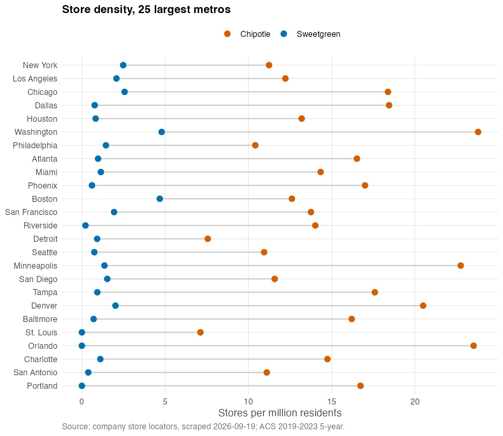
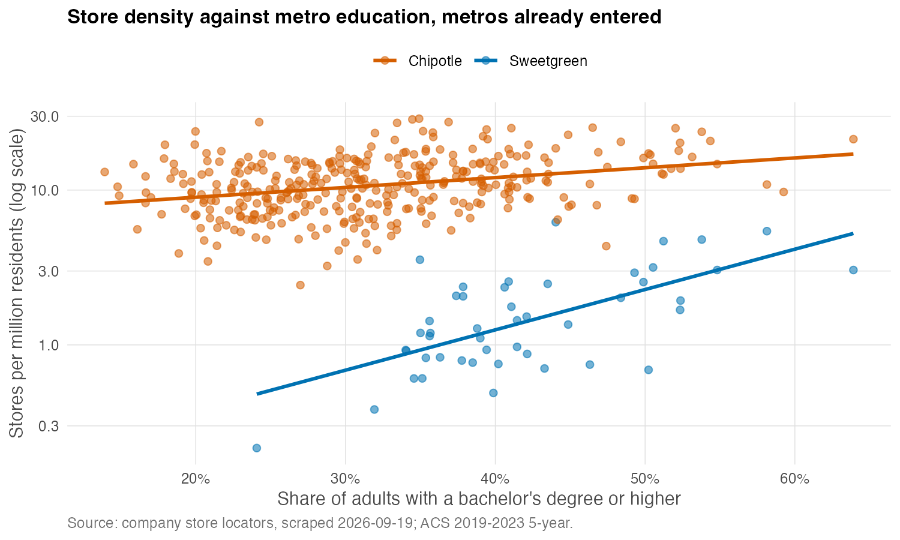
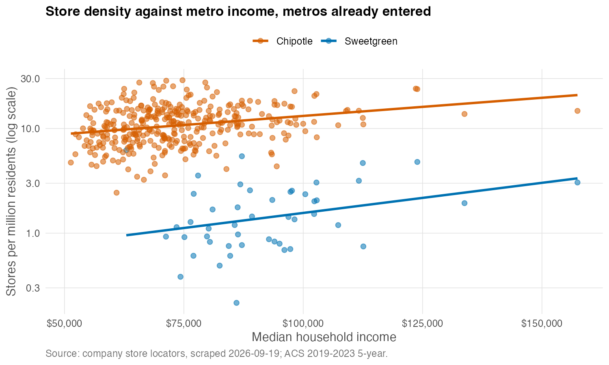
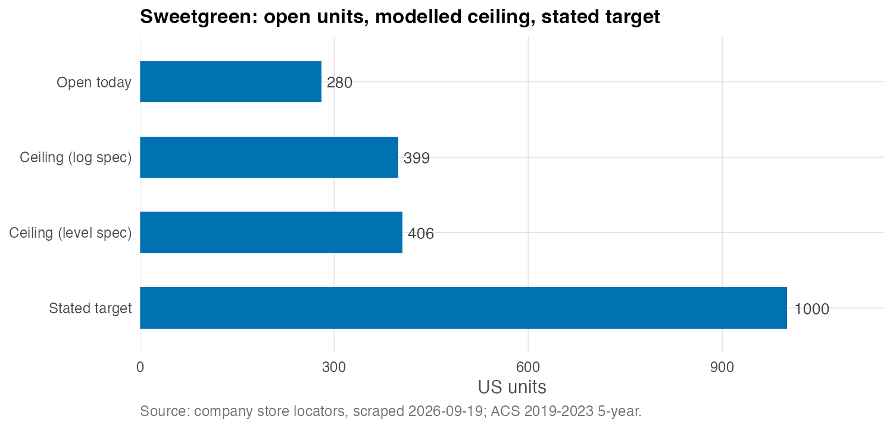

This blog post scrapes data of store locations from Sweetgreen and Chipotle, in
order to glean insights into what the chosen places have in common and the
decision-making behind choosing the stores. Sweetgreen has opened 292 restaurants,
and it plans to open 1000 units by 2030. Whether this goal is achievable is not
the question; rather, the question is: what are the rest of the ~700 places 
that Sweetgreen has in mind to open stores in?

## Data Collection and Cleaning
Sweetgreen puts its entire store base on one server-rendered page. Chipotle
publishes a sitemap encoding state and city information about all 4,155 stores it
has, so two XML files give all 4,155 stores without fetching a single store page.
There were no logins, paywalls or CAPTCHAs involved. 

There were two problems encountered during the data cleaning process. 

1. The first is regarding parsing error of the ZIP code. For example, 
a store in Boston was  silently rendered as `2109` when it was supposed to be 
`02109`. Without doing anything, Boston would disappear. In total, there are 
43 out of 299 Sweetgreen ZIPs that share the same problem. 

2. Second is regarding mismatch between location on the website and that in the 
Census. Since NYC boroughs aren't Census places, there is no "Brooklyn" or "Bronx" 
in the place file. Similar problems with New England towns, which are county
subdivisions rather than places. As such, a county-subdivision layer is added
for the six New England states so that city-county names are consolidated.

Both problems would haved remove important markets. After fixing them, 
95.7% of Sweetgreen and 95.2% of Chipotle stores match a metro.

## The Naive Build

The naive benchmark for the future pathway of expansion for Sweetgreen is that 
it follows Chipotle's national density applied to US metro population. 

Chipotle runs 3,807 restaurants across US metro areas, about 13.3 per million
residents. Give Sweetgreen the same density over the same 286.5 million people
and it "should" support about 3,800 restaurants, which is simply Chipotle's own
footprint. This seems implausible, the and rest of the post tries to investigate
whether the naive build can hold or not. 

## Elasticity with respect to education

We can't observe which metro could support a Sweetgreen store, but what we do
observe is something correlated with it. That is, whether there is a store in 
the metro, and what the density of the stores is in that metro. Log is being
used here because it ensures that density is non-negative. More importantly,
i am comparing chains of different sizes. Chipotle is much larger than Sweetgreen.
When analyzed in levels, the two education coefficients came out 12.2 and 13.9, which
were almost identical, but 12.2 on a bse of 1.82 is enormous and 13.9 on a base of
11.66 is modest. Logs convert to percentages.

The $R^2$ is 0.43 for Sweetgreen and 0.12 for Chipotle. Metro characteristics 
predict Sweetgreen's footprint well and Chipotle's badly, because Chipotle is 
nearly everywhere, so knowing a metro is rich or educated barely helps to guess 
its Chipotle count.

Because the vertical axis is on a log scale, the figure can be read directly.
The vertical gap between the two lines is the ratio of the two chains'
densities, and the difference in their slopes is the difference in how
strongly each responds to education. Sweetgreen's line sits far lower, because
it is a much smaller chain, and it is visibly steeper, because it is far more
sensitive to how educated a metro is.

### Elasticity with respect to income

This chart appears to contradict the regression. Both lines slope upward, as if
richer metros attract more of both chains, yet in the regression income's
coefficient is indistinguishable from zero for both. Nontheless, the two are not in
conflict. The lines here are fitted to income alone, while the regression asks
what income adds *once you already know a metro's graduate share*. Across the
metros Sweetgreen has entered, income and education move together (correlation
0.55), so income on its own picks up education's effect. The income effect 
disappears when we hold Hold education fixed. 

The log-specification results are as follows:

- **Income does nothing for either chain.** The log-income coefficients are
  −0.49 (standard error 0.60) for Sweetgreen and 0.18 (0.17) for Chipotle.
- **Education does almost all of the work, and it separates the two chains.**
  A one-percentage-point rise in the share of adults with a bachelor's degree
  is associated with about 6.6% more Sweetgreen restaurants per capita, and
  about 1.0% more Chipotles. The two coefficients are roughly four standard
  errors apart.
- **Density matters little.** Chipotle's density elasticity is statistically
  significant but small (0.06); Sweetgreen's is larger but imprecise (0.12,
  standard error 0.12).

From the regression, we could tell that income does not affect the choice of 
stores, but rather education does. The same point can be made without a regression. In
the median metro Sweetgreen operates in, 40.6% of adults hold a bachelor's
degree. For Chipotle the figure is 30.8%, almost exactly the 30.6% median
across all US metros. Chipotle sits on the national median; Sweetgreen sits ten
points above it.

## The ceiling, and why I do not fully trust it

Carrying the relationship from the 47 metros Sweetgreen has entered to the 340
it has not, and adding up, gives a ceiling of about 399 restaurants. There are 280
stores it runs in metro areas today, so there are roughly 120 more. The level 
specification gives 406. Two functional forms that disagree about the mechanism agree about the
answer to within 2%, which suggests the number comes from the data rather than
from my modelling choices.

Exponentiating a fitted log value recovers the
*typical* metro rather than the *average* one, so predictions are scaled up by
a smearing correction (Duan, 1983). Here that factor is 1.17, a 17% adjustment.
Predictions are also capped at the highest density Sweetgreen has reached
anywhere, but in the log model the cap never binds.

The first version of this model was not so well behaved. Fitted in levels, it
named San Juan, Puerto Rico, where neither chain has a single store, as
Sweetgreen's best expansion market. Its income coefficient came out negative,
so a poorer metro read as a more promising one. A straight line has no idea
that store density cannot be negative. Modelling log density makes that
constraint structural, since $e$ raised to any power is positive. It is the same
reason discrete-choice demand models we learned in Applied Micro I write market shares as
$\exp(\delta_j)/\sum_k \exp(\delta_k)$ rather than as a linear index. These are locations chosen by a firm,
not purchases chosen by consumers.

## Conclusion

The naive build implies about 3,800 restaurants. The
model implies about 400. The target is 1,000.

So where would the remaining ~700 come from? It isdefinitely not from new
cities. The largest
opportunities in metros Sweetgreen has not entered are Portland (about 4
stores), St. Louis (3.5), Orlando (3.4), Pittsburgh (3.2), Kansas City (2.9)
and Cincinnati (2.8). The top twenty un-entered metros add up to about 39
stores, and the entire un-entered universe to about 120.

Setting aside
the ~120 from new metros, the 47 metros Sweetgreen already operates in would
need to hold about 880 restaurants, which is 5.5 per million residents. That would
be 3.2 times their
current 1.7. The only metros where Sweetgreen already runs that densely are
Bloomington, Indiana and Ann Arbor, college towns with one and two stores. Its
densest large markets, Washington (4.8 per million) and Boston (4.7), was close 
but still fall short of 5.5. Hitting the target would require the *average* existing market to be
denser than Sweetgreen's best large market is today.

As such, the question to Sweetgreen is not which cities they choose to expand next, 
but what evidence there is that New York, Los
Angeles and Chicago, currently at 2.5, 2.1 and 2.6 stores per million, can
roughly triple. However, nothing in the current footprint shows that happening anywhere at scale

## Caveats

- **This appraoch only measures strategy from the firm's perspective** A store base 
  is a stock unit, which is where
  Sweetgreen has chosen to be so far, constrained by capital, construction and
  management attention. The choice is also endogenous. Sweetgreen opens where
  unobserved local appeal (office density, lunch culture, rents, who is
  already on the block) is high, and I observe none of it. This is the same
  structure as price in a demand model, where firms charge more where
  unobserved appeal is high; the standard fix is a cost shifter that moves
  price without moving demand. The analogue here would be something like
  commercial rent per square foot, which I do not have.
- **No opening dates.** I cannot tell "has not entered yet" from "entered and
  stalled." This is the biggest thing the analysis cannot answer.
- **Income and education are correlated** (0.55 across entered metros), so
  their individual coefficients are less precise than they look.

## Data and code

- **Sweetgreen locations:** `sweetgreen.com/locations`, one request,
  19 September 2026.
- **Chipotle locations:** `locations.chipotle.com/sitemap1.xml` and
  `sitemap2.xml`, two requests, same date.
- **Metro population, income and education:** American Community Survey
  2019–2023 5-year estimates, via `tidycensus`.
- **Place, town and metro boundaries:** Census TIGER/Line 2023, via `tigris`.

Both sites' `robots.txt` files permit crawling these pages. Each request
identified me in its user agent, the requests were spaced a second apart, and
the raw responses are cached so the analysis reproduces without contacting
either site again.
