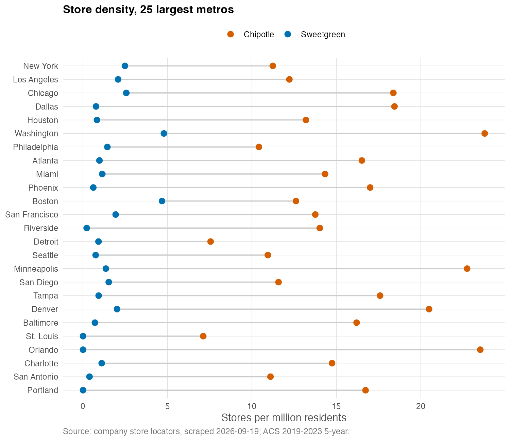
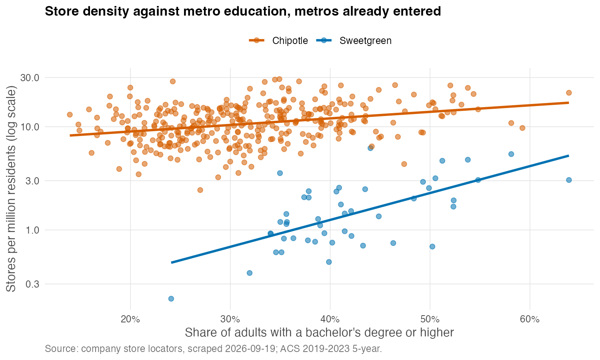
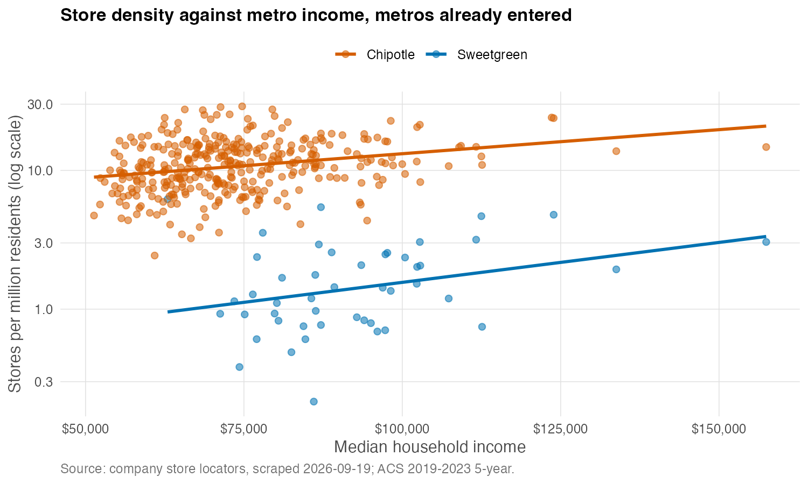
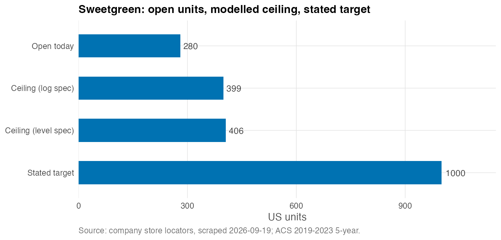

Sweetgreen is an American fast-casual restaurant chain that specializes in
healthy, made-to-order salads, grain bowls and protein plates. On 19 September
2026 its website listed 299 U.S. locations, 292 open and 7 coming soon. In 2022
its CEO said the company intended to reach 1,000 restaurants by the end of the
decade.[^target] By 2026 the trade press was describing that path as "now
seriously in question,"[^rb] but 1,000 remains the company's own statement of how
much room it has to grow.

For a restaurant chain, revenue growth comes mostly from opening new stores, so a fundamental equity
analyst covering Sweetgreen needs to know whether the store count built into the
forecast is realistic. This post asks whether the 1,000 target needs adjusting
and, setting the 2030 deadline aside, where the remaining ~700 restaurants could
plausibly go.

To answer it, I scrape the store locations of Sweetgreen and Chipotle, match
every store to its metro area, and compare where each chain has chosen to open.
Chipotle is the natural reference point. Like Sweetgreen it is fast-casual, with
bowls assembled to order at a counter, but it is much further along: with about
4,155 U.S. stores, it shows what a fully built-out version of this format looks
like. It plays two roles below. First it provides a naive upper bound for
Sweetgreen, and then it serves as a control that separates what matters for
Sweetgreen specifically from what matters for restaurants in general.

## Data Collection and Cleaning

Sweetgreen lists its entire store base on one server-rendered page, so a single
request returns all 299 locations. Chipotle publishes a sitemap that encodes the
state and city of each of its 4,155 stores, so two XML files cover all of them
without fetching a single store page.

When I tried to match stores to metro areas, there were two problems, and each would have silently
removed important markets.

1. **ZIP codes lost their leading zero.** A store in Boston was rendered as
   `2109` instead of `02109`, and 43 of the 299 Sweetgreen ZIPs had the same
   problem. Left alone, a ZIP-based match would have dropped Boston along with
   much of the Northeast.

2. **Some store cities are not Census places.** New York City's boroughs are
   not Census places, so the place file has no "Brooklyn" or "Bronx", and New
   England towns are county subdivisions rather than places. I added a
   county-subdivision layer for the six New England states and handled the
   boroughs and consolidated city-counties separately.

After both fixes, 95.7% of Sweetgreen locations and 95.2% of Chipotle stores
match a metro area. The 280 open Sweetgreen stores inside U.S. metro areas are
the base for everything that follows.

## The Naive Build

The simplest way to size Sweetgreen's opportunity is to assume it can eventually
match Chipotle's density everywhere. Chipotle runs 3,807 restaurants across U.S.
metro areas, about 13.3 per million residents. Give Sweetgreen the same density
over the same 286.5 million people and it "should" support about 3,800
restaurants, which is simply Chipotle's own footprint.

The figure shows why this naive buildup is unrealistic. In every one of the 25 largest
metros, Sweetgreen sits far below Chipotle. The naive build also assumes that
Sweetgreen wants the same kinds of places Chipotle does, and the rest of the
post tests that assumption.

## Predicting where Sweetgreen would open

We cannot observe directly which metros could support a Sweetgreen, but we can
observe how densely each chain has built in the metros it has already entered
and ask what those metros have in common. For each chain separately, I regress
log stores per million residents on log median household income, log population
density and the share of adults with a bachelor's degree, using only the metros
that chain has entered (47 for Sweetgreen, 353 for Chipotle).

Taking logs puts two chains of very different sizes on the same percentage
scale. In levels, the education coefficients come out almost identical, 12.2 and
13.9 extra stores per million for Sweetgreen and Chipotle. But 12.2 on
Sweetgreen's average of 1.82 stores per million is enormous, while 13.9 on
Chipotle's 11.66 is modest. In logs, each coefficient reads as a percentage
response. For income and population density it is an *elasticity*, the percent
change in store density for a 1% change in the variable. For education, which
is not logged, it is the percent change for a one-percentage-point rise in the
bachelor's share.

### Education predicts Sweetgreen, not Chipotle

Because the vertical axis is on a log scale, the figure can be read directly.
The vertical gap between the two lines is the ratio of the two chains'
densities, and the difference in their slopes is the difference in how strongly
each responds to education. Sweetgreen's line sits far lower because it is a
much smaller chain, and it is visibly steeper because it is far more sensitive
to how educated a metro is.

A one-percentage-point rise in the
bachelor's share is associated with about 6.6% more Sweetgreen restaurants per
capita, but only about 1.0% more Chipotles, and the two coefficients are roughly
four standard errors apart. This is where Chipotle earns its place as a control.
This tells us that education is not simply where fast-casual restaurants go, but it is where Sweetgreen
goes. The fit also tells the same story in that metro characteristics explain 43% of the
variation in Sweetgreen's density but only 12% of Chipotle's, because Chipotle is
nearly everywhere, and knowing a metro is rich or educated barely helps to guess
its Chipotle count.

The same point can be made without a regression. In the median metro Sweetgreen
operates in, 40.6% of adults hold a bachelor's degree. For Chipotle the figure is
30.8%, almost exactly the 30.6% median across all U.S. metros.

### Income adds nothing once education is known

This chart appears to contradict the regression that we have above. Both lines slope upward, as if
richer metros attract more of both chains, yet in the regression income's
coefficient is indistinguishable from zero for both. Sweetgreen has −0.49 (standard error 0.60)
and Chipotle has 0.18 (0.17). It turns out that the two are not in conflict. The
lines here are fitted to income alone, while the regression asks what income adds
*once you already know a metro's graduate share*. Across the metros Sweetgreen
has entered, income and education move together (correlation 0.55), so income on
its own picks up education's effect, and that effect disappears once education
is held fixed.

Population density matters little either way. Chipotle's density elasticity is
statistically significant but small (0.06), and Sweetgreen's is larger but
imprecise (0.12, standard error 0.12). Sweetgreen's footprint is an education
story, and that is exactly why Chipotle's national density cannot be applied to
it. The 340 metros Sweetgreen has not entered have a median bachelor's share of
29.5%, eleven points below the metros it serves.

## A Ceiling of About 400 Restaurants

Carrying the fitted relationship from the 47 metros Sweetgreen has entered to the
340 it has not, and adding up, gives a ceiling of about 399 restaurants. On top of the 280
it runs in metro areas today, there are roughly 120 more that Sweetgreen could open. The same exercise with the
levels specification gives 406. Two functional forms that disagree about the
mechanism agree about the answer to within 2%, which suggests the number comes
from the data rather than from my modelling choices.

Two adjustments sit behind the log estimate. Exponentiating a fitted log value
recovers the *typical* metro rather than the *average* one, so predictions are
scaled up by a smearing correction (Duan, 1983). Here that factor is 1.17, a 17%
adjustment. Predictions are also capped at the highest density Sweetgreen has
reached anywhere, but in the log model the cap never binds.

The log specification is also what makes the model behave sensibly at all. The
first version, fitted in levels, named San Juan, Puerto Rico, where neither chain
has a single store, as Sweetgreen's best expansion market. Its income coefficient
came out negative, so a poorer metro read as a more promising one. A straight
line has no idea that store density cannot be negative. Modelling log density
makes that constraint structural, since $e$ raised to any power is positive. It
is the same reason the discrete-choice demand models from Applied Micro I write
market shares as $\exp(\delta_j)/\sum_k \exp(\delta_k)$ rather than as a linear
index, even though these are locations chosen by a firm rather than purchases
chosen by consumers.

## Conclusion

The naive build implies about 3,800 restaurants, the model about 400, and the
target is 1,000. So where would the remaining ~700 come from?

Not from new cities. The largest opportunities in metros Sweetgreen has not
entered are Portland (about 4 stores), St. Louis (3.5), Orlando (3.4),
Pittsburgh (3.2), Kansas City (2.9) and Cincinnati (2.8). The top twenty
un-entered metros add up to about 40 stores, and the entire un-entered universe
to about 120.

That leaves the 47 metros Sweetgreen already operates in, which would need to
hold about 880 restaurants, or 5.5 per million residents. That is 3.1 times their
current 1.7. The only metros where Sweetgreen already runs at or near that
density are Bloomington, Indiana and Ann Arbor, college towns with one and two
stores. Its densest large markets, Washington (4.8 per million) and Boston (4.7),
come close but still fall short. Hitting the target would require the *average*
existing market to be denser than Sweetgreen's best large market is today.

For an analyst, this changes what the 1,000 target is a bet on. It is not a bet
on Sweetgreen finding new cities; it is a bet that New York, Los Angeles and
Chicago, now at 2.5, 2.1 and 2.6 stores per million, can roughly triple, and
nothing in the current footprint shows that happening anywhere at scale. The
target is better treated as an upside scenario than as the base case for revenue
growth. The evidence that would justify moving back toward it is a rising share
of new openings in metros Sweetgreen already serves, and density in its largest
markets climbing toward 5.5 per million.

## Caveats

- **This approach only measures strategy from the firm's perspective.** A store
  base is a stock: it shows where Sweetgreen has chosen to be so far,
  constrained by capital, construction and management attention. The choice is
  also endogenous. Sweetgreen opens where unobserved local appeal (office
  density, lunch culture, rents, who is already on the block) is high, and I
  observe none of it. This is the same structure as price in a demand model,
  where firms charge more where unobserved appeal is high; the standard fix is a
  cost shifter that moves price without moving demand.
- **No opening dates.** I cannot tell "has not entered yet" from "entered and
  stalled." This is the biggest thing the analysis cannot answer.
- **Income and education are correlated** (0.55 across entered metros), so their
  individual coefficients are less precise than they look.

## Data and code

- **Sweetgreen locations:** `sweetgreen.com/locations`, one request,
  19 September 2026.
- **Chipotle locations:** `locations.chipotle.com/sitemap1.xml` and
  `sitemap2.xml`, two requests, same date.
- **Metro population, income and education:** American Community Survey
  2019–2023 5-year estimates, via `tidycensus`.
- **Place, town and metro boundaries:** Census TIGER/Line 2023, via `tigris`.

**Code:** [github.com/1iiiiii/Web-Scraping-in-R](https://github.com/1iiiiii/Web-Scraping-in-R)
contains the scripts and cached raw responses

[^target]: Restaurant Dive, *Sweetgreen on track for 1K units by 2030 despite profitability challenges*, 11 August 2022. <https://www.restaurantdive.com/news/sweetgreen-1000-restaurants-by-2030/629384/>

[^rb]: Restaurant Business, *Sweetgreen wanted to reach 1,000 units by the end of the decade. It may take a bit longer*, 2026. <https://www.restaurantbusinessonline.com/operations/sweetgreen-wanted-reach-1000-units-end-decade-it-may-take-bit-longer>
