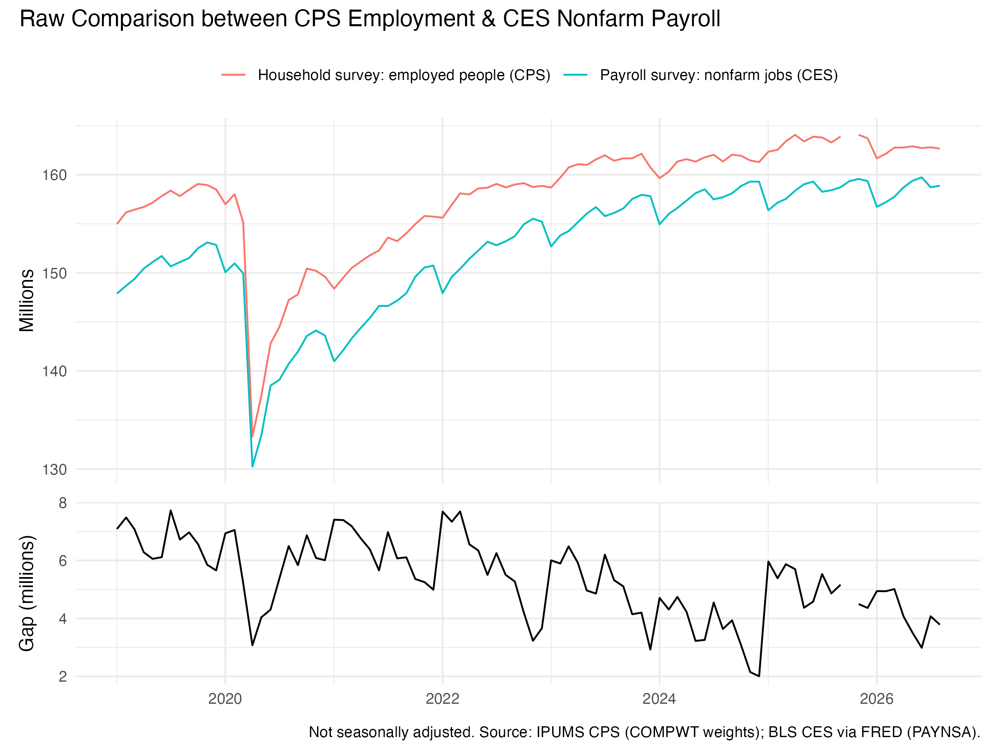
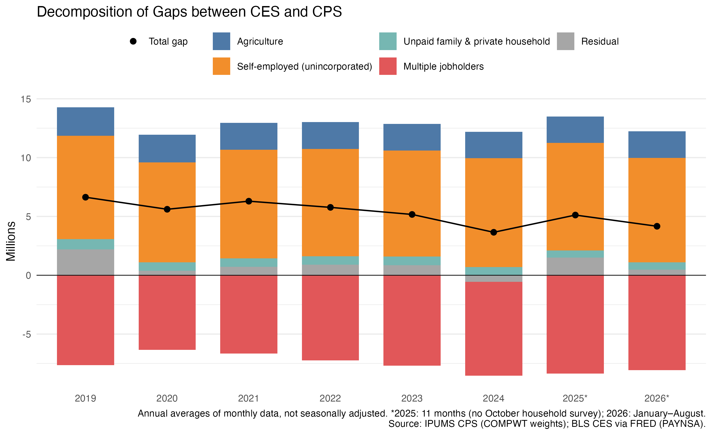
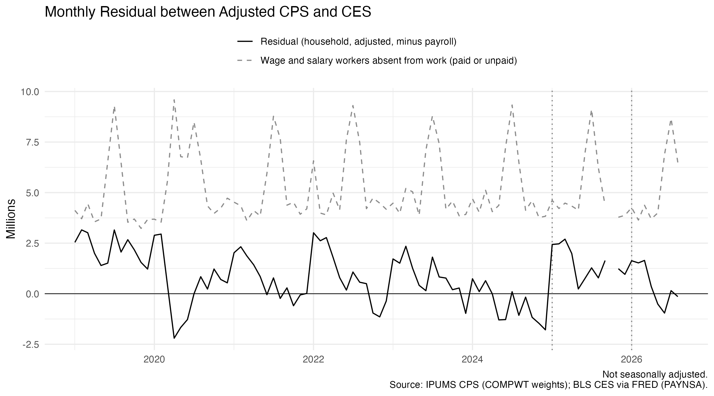

BLS publishes two employment numbers that usually differ from each other. The payroll survey counts
jobs, while the household survey counts people who have a job. In 2025 the household
survey found about 163.5 million employed people, while payrolls counted about
158.4 million jobs, which is a gap of 5 million. The post attempts to answer the question: how much of the gap is simply
the two surveys counting different things, and how much is left over?

## Comparison between CPS and CES

| | Household survey (CPS) | Payroll survey (CES) |
|---|---|---|
| Counts | people with a job | jobs |
| Sample | about 60,000 households | about 119,000 businesses and agencies |
| A person with multiple jobs | counted once | counted multiple times |
| Self-employed, unpaid family, private-household workers | counted | not counted |
| Farm workers | counted | not counted |
| On unpaid leave | counted as employed | not counted |

BLS publishes a recipe for translating one concept into the other. Starting from
$\text{Household Employment HE}$, I subtract the groups payrolls never see (
$\text{Agriculture A}$, $\text{the Unincorporated Self-Employed S}$,$\text{Unpaid Family Workers UFW}$ and $\text{Private-Household Workers PHW}$) and add back the second jobs of $\text{Multiple
jobholders M}$. Whatever still separates the result from $\text{Payroll Jobs NFP}$ is $\text{the Residual \epsilon$:

$$
\underbrace{HE - NFP}_{\text{gap}} \;=\; A + S + UFW + PHW - M + R
$$

The first five terms are simply definitional differences. Neither survey is wrong about them, and the two survey data are quite similar to each other after bridging. The
residual is where at least one survey is off.

## Data and weights

The household data are IPUMS CPS basic monthly microdata from January 2019 to
August 2026, 91 months in all. October 2025 is missing because the household
survey was not collected during the government shutdown. Payroll jobs are total
nonfarm employment, not seasonally adjusted, in their current vintage.

Every number here is a population total, so each respondent has to count for the
number of people they represent. I use `COMPWT`, the composite weight BLS uses
for its published estimates. With it, my January 2019 employment total is
154.964 million, exactly BLS's published figure. The basic weight `WTFINL`
gives 155.580 million, 616,000 too many, and an unweighted count of survey rows
would not be a statement about the country at all.

```{r}
#| eval: false
#| code-fold: true
#| code-summary: "The weighted totals behind every figure"
employment <- cps |>
  filter(EMPSTAT %in% c(10, 12),
         AGE >= 16) |>
  mutate(ag = IND >= 170 & IND <= 290) |>
  group_by(YEAR, MONTH) |>
  summarise(
    employed                  = sum(COMPWT) / 1e6,
    agriculture               = sum(COMPWT[ag]) / 1e6,
    self_employed             = sum(COMPWT[CLASSWKR == 13 & !ag]) / 1e6,
    unpaid_family_workers     = sum(COMPWT[CLASSWKR == 29 & !ag]) / 1e6,
    private_household_workers = sum(COMPWT[IND == 9290 & !(CLASSWKR %in% c(13, 29))]) / 1e6,
    multiple_jobholders       = sum(COMPWT[MULTJOB == 2 & !ag & !(CLASSWKR %in% c(13, 29))]) / 1e6,
    absent_ws                 = sum(COMPWT[EMPSTAT == 12 & !ag & !(CLASSWKR %in% c(13, 29))]) / 1e6,
    .groups = "drop"
  )
```

This snippet of code shows how each category is handled to avoid problems with double-counting. Each person is subtracted at most once. A self-employed farmer counts only as
agriculture, and a self-employed nanny only as self-employed.

## The gap



The household survey sits above payrolls in every month. The gap was about 7
million in 2019 and narrowed to between 2 and 4 million by late 2024. Both
series are unadjusted, so the gap wobbles with the seasons. Notice that there is a huge spike between December 2024 and January 2025 (~+4 millions), and this gap is too large to simply be a seasonal change. This is why we need to decompose the data to see what drives the change. 

## Decomposition by Year: CES vs. CPS



Bars above zero widen the gap and bars below narrow it. The dots mark the net
gap. The definitions account for most of the gap in every year, which confirms that definitional differences are what's driving the discrepancies (4.4 of the 6.6
million in 2019, and 3.6 of the 5.1 million in 2025). The category self-employment is the
largest driving force, usually around 9 million. Multiple jobholding pulls the other way, and it
grew from 7.7 million in 2019 to 8.4 million in 2025, which is why the
definitional part of the gap shrank over time.

The grey residual is the more interesting part. It was 2.2 million in 2019,
under 1 million from 2020 to 2023, negative in 2024, and 1.5 million in 2025.
Each January the household survey switches to new Census population estimates
and never revises earlier months. BLS reports that the January 2025 update added
2.0 million to employment, mostly because of higher estimates of immigration.
The microdata show the same thing that household employment usually falls about 0.8
million from December to January, but in January 2025 it rose by 1.05 million,
an excess of about 1.9 million.

## Residual Analysis



The update can also move in the other direction. In January 2026, lower estimated net
migration and a Census methodology change cut household employment by 1.4
million, according to BLS. The decomposition I have indicates a difference of about
1.2 million.

The largest change in residual happens in Spring 2020, where there was a 5 million drop in residual. The number of wage and salary workers absent from
work jumped from 3.5 million in February to 9.6 million in April. Unpaid
absentees count as employed in the household survey but not on payrolls, so if
they were driving the residual it should have risen. Instead it fell from +3.0
to −2.2 million. This suggests that there is something else that's driving the discrepancy. One possibility could be the fact that payrolls count anyone paid for any part of the pay period that
includes the 12th, so workers laid off mid-period still appear as jobs. Another is that
in-person household interviews were suspended that spring, so the household
survey was measuring less precisely just when the labor market moved fastest.

## Takeaway

To conclude, most of the gap between the two jobs numbers is definitional. Self-employment
and farm work are driving the difference larger, while multiple jobs are shrinking the difference. The residual is small in
ordinary years, but the anomalous movements in residuals always come with a reason . Sometimes
the problem is the household survey's population base, as in 2024, and sometimes it
looks like the payroll survey's pay-period definition, as in spring 2020. The residual could give us a better idea about what drives the differences so that we could know which survey better reflects the underlying trend during that specific point of time. 

## Data and code

- **Household survey:** IPUMS CPS basic monthly samples, extract `cps_00003`.
  Sarah Flood, Miriam King, Renae Rodgers, Steven Ruggles, J. Robert Warren,
  Daniel Backman, Etienne Breton, Grace Cooper, Julia A. Rivera Drew, Stephanie
  Richards, David Van Riper, and Kari C.W. Williams. *IPUMS CPS: Version 13.0*
  [dataset]. Minneapolis, MN: IPUMS, 2025. <https://doi.org/10.18128/D030.V13.0>
- **Payroll survey:** BLS Current Employment Statistics, total nonfarm, not
  seasonally adjusted, via FRED (`PAYNSA`), accessed 28 September 2026.
- **Bridge method:** BLS, [Employment from the CPS adjusted to the CES concept](https://www.bls.gov/web/empsit/ces_cps_trends.htm).
- **Population controls:** BLS, [January 2025 adjustments](https://www.bls.gov/cps/methods/population-controls/population-control-adjustments-2025.pdf)
  and [January 2026 adjustments](https://www.bls.gov/cps/methods/population-controls/experimental-series-accounting-for-january-2026-population-control-effects.htm).
- **Code:** [github.com/1iiiiii/Data-Visualization-in-R](https://github.com/1iiiiii/Data-Visualization-in-R).
